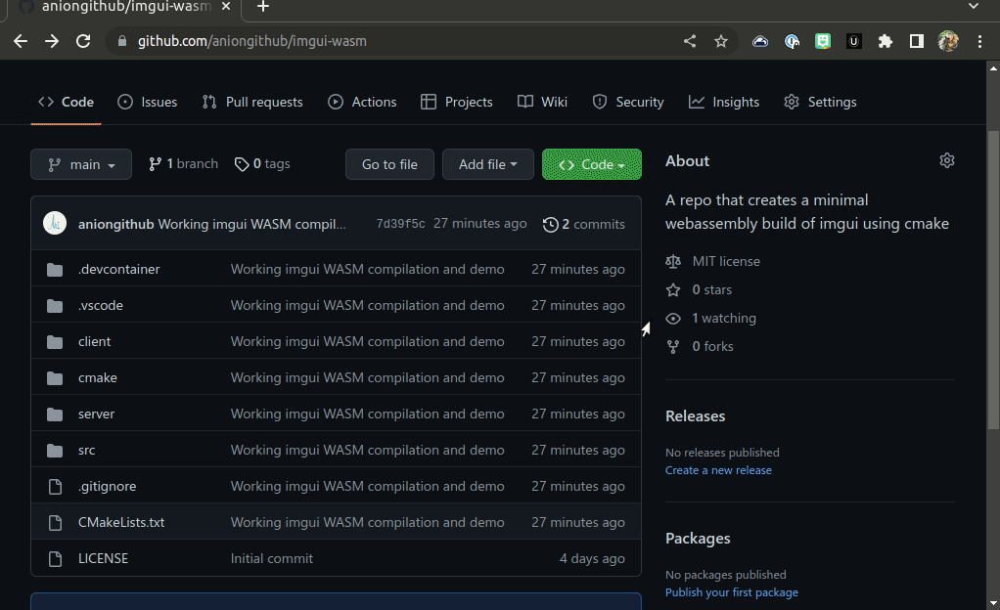
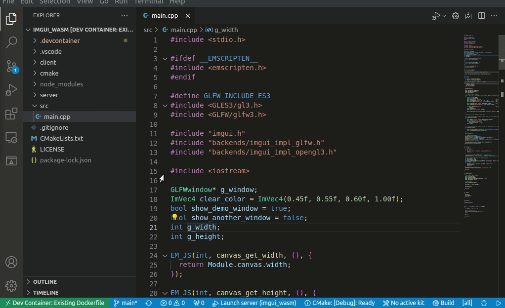

# ImGui WASM

This repository is an example of how to compile Omar [Cornut's excellent Dear ImGui](https://github.com/ocornut/imgui) library and demo as a web assembly for use within a browser.

## Getting started

### Github Codespaces

The easiest way to get started is to use [GitHub CodeSpaces](https://github.com/features/codespaces). This allows you to directly open an instance, configure the environment, tool and build/run directly within the browser.

### Devcontainer

However, since Codespaces costs 💸 and is only free for a set number of core-hours per month - you can run this locally within a devcontainer for equally little effort.

#### Installation

[Install any pre-requisites](https://code.visualstudio.com/docs/devcontainers/containers#_system-requirements) for running VS Code + devcontainer locally, depending on your system and OS.

*Note that this only has to be done once for any project that uses devcontainers. All further setup should be automated and containerized by the project you're using.*

Once you're done, you can simply open the cloned repository in VS Code, invoke `Reopen in container` from the pop-up or command palette and wait for the container to finish building. You're done!

